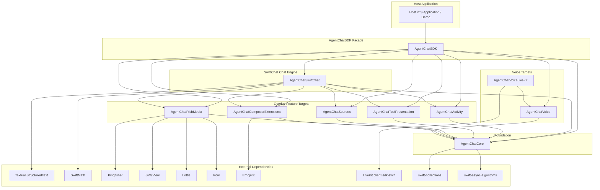

# AgentChatSDK Architecture Specification (Realigned)

`AgentChatSDK` is a modular, production-ready Swift Package that extracts the upgraded **`sachaservan/SwiftChat` Full Demo** (`d6f54ccf9e84d2fec672b7b89d5a67dd6ee0f957`) and repository **`swiftchat-overlay`** into an embeddable, multimodal agentic chat SDK.

It preserves the proven UI layout, typography, markdown engine (`Textual`), LaTeX math parser (`SwiftMath`), and interaction models of SwiftChat while modularizing reasoning activity timelines, tool execution disclosures, citation clustering, media caching, and optional realtime voice into discrete, testable SPM targets.

---

## 1. Package Target Dependency Graph



---

## 2. Modular Target Breakdown

| SPM Target | Scope & Responsibilities | Key Types | Dependencies |
|---|---|---|---|
| **`AgentChatCore`** | Canonical SwiftChat models, SDK configuration, event definitions, voice protocols, and async streaming utilities. No UI dependencies. | `Chat`, `Message`, `MessageRole`, `MessageContentPart`, `WebSearchSource`, `Attachment`, `ModelType`, `AgentChatConfiguration`, `AgentChatRuntimeProvider`, `AgentVoiceContracts`, `AsyncEventBuffer` | `swift-collections`, `swift-async-algorithms` |
| **`AgentChatActivity`** | Agent reasoning timeline, live step execution tracker, elapsed time indicators, and timeline bridge. Migrated cleanly from `swiftchat-overlay`. | `AgentActivityTimelineView`, `AgentActivityStore`, `AgentActivityRowView`, `AgentActivityDetailViews`, `AgentActivityDemoDriver`, `AgentActivityTimelineBridge` | `AgentChatCore` |
| **`AgentChatToolPresentation`** | Expandable tool execution disclosures, collapsible status banners, detailed JSON payload inspector, and custom tool renderer registry. | `ToolExecutionDisclosure`, `ToolCallInspectionView`, `ToolExecutionStatus`, `AgentToolRendererRegistry`, `ToolExecutionDemoStore`, `ToolExecutionDemoBridge` | `AgentChatCore` |
| **`AgentChatSources`** | Citation badge clusters, inline section sources chips, and modal citation sheet presentation for web search results. | `SourcesSheetView`, `InlineSectionSourcesView`, `SectionSourcesPresentation`, `SectionSourceClusterRenderer` | `AgentChatCore` |
| **`AgentChatRichMedia`** | Multimodal inline visual content. Enhances `SafeInlineImageMediaView` with Kingfisher image caching, `SafeInlineVideoMediaView`, `InlineSVGMediaView` (SVGView), and `AgentLottieMediaView` (Lottie + Pow with Reduce Motion safety). | `SafeInlineImageMediaView`, `InlineSVGMediaView`, `AgentLottieMediaView`, `SafeInlineVideoMediaView`, `SafeInlineYouTubeMediaView`, `RichMediaFallbackView` | `AgentChatCore`, `Kingfisher`, `SVGView`, `Lottie`, `Pow` |
| **`AgentChatComposerExtensions`** | Composer action menu, model selector menu (`SelectedModelMenu`), and emoji picker popover/sheet (`AgentEmojiPicker`). | `SelectedModelMenu`, `AgentEmojiPicker` | `AgentChatCore`, `EmojiKit` |
| **`AgentChatVoice`** | Reusable voice session protocol (`AgentVoiceSessionProvider`), state machine (`AgentVoiceSessionState`), deterministic mock provider (`AgentMockVoiceProvider`), and interactive glowing voice orb view (`AgentVoiceOrbView`). | `AgentVoiceOrbView`, `AgentMockVoiceProvider`, `AgentVoiceSessionState`, `AgentVoiceSessionProvider` | `AgentChatCore` |
| **`AgentChatVoiceLiveKit`** | Optional WebRTC/LiveKit voice provider target isolating realtime transport dependencies. | `LiveKitVoiceSessionProvider` | `AgentChatVoice`, `LiveKit` |
| **`AgentChatSwiftChat`** | Canonical SwiftChat UI engine extracted from upstream. Contains conversation scrolling, multi-turn messages, rich message formatting (`Textual` + `SwiftMath`), and composer input. | `ChatContainer`, `ChatView`, `ChatViewModel`, `MessageView`, `MessageInputView`, `LaTeXMarkdownView`, `WebSearchBox`, `URLFetchBox`, `AttachmentPreviewBar`, Theme, Constants | `AgentChatCore`, `AgentChatActivity`, `AgentChatToolPresentation`, `AgentChatSources`, `AgentChatRichMedia`, `AgentChatComposerExtensions`, `Textual`, `SwiftMath` |
| **`AgentChatSDK`** | Public façade target exposing the standard interface for external host applications. | `AgentChatView`, `AgentChatSession`, `AgentChatSDKInfo` | All targets above (except `AgentChatVoiceLiveKit` which is linked optionally) |

---

## 3. Public API & Host App Integration

Host applications embed `AgentChatSDK` through SPM:

```swift
import SwiftUI
import AgentChatSDK

struct ContentView: View {
    @StateObject private var session = AgentChatSession(
        configuration: AgentChatConfiguration()
    )

    var body: some View {
        AgentChatView(
            session: session,
            configuration: session.configuration
        )
    }
}
```

### Architecture Guarantees:
1. **Preserved SwiftChat UX**: Top-level `AgentChatView` embeds canonical `ChatContainer`, ensuring 100% fidelity with the proven SwiftChat layout, composer behavior, keyboard handling, and scrolling.
2. **Canonical Models**: All modules operate on canonical SwiftChat models (`Chat`, `Message`, `MessageContentPart`, `Attachment`). No divergent AST or custom message structures are introduced.
3. **Safe Additive ChatGPT Libraries**: External libraries from the ChatGPT iOS stack (Kingfisher, SVGView, Lottie, Pow, EmojiKit, Collections, AsyncAlgorithms) are utilized additively with defensive fallbacks and zero disruption to the core layout.
4. **Decision Gate Enforced**: Core markdown (`Textual`) and LaTeX math (`SwiftMath`) are preserved. Proposed replacements (`Highlightr`, `iosMath`, `swift-markdown`, `KaTeX`, `STTextKitPlus`, `Motion`) require explicit user authorization.
